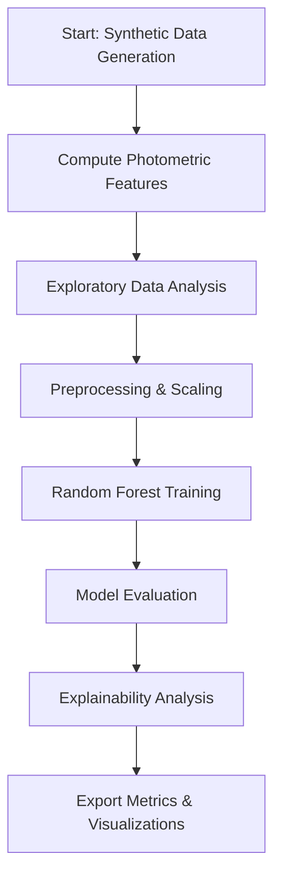

# Explainable AI for Stellar Object Classification


## Project Overview

This repository contains a single end-to-end deep learning assignment notebook for an astrophysics-inspired classification task.

The project builds a synthetic Sloan Digital Sky Survey (SDSS)-style photometric dataset for three object classes: **STAR**, **GALAXY**, and **QUASAR**. It trains a **Random Forest classifier** and applies **Explainable AI** (XAI) techniques to interpret the model at both global and local levels.

### Why this project exists

- To demonstrate how synthetic astronomical survey data can be used for classification.
- To show a complete machine learning workflow from data generation and EDA to model training and explainability.
- To compare model-based feature importance with modern XAI tools such as SHAP and LIME.

### Main objectives

- Generate synthetic photometric observations with `u, g, r, i, z` magnitudes and derived color indices.
- Train a Random Forest classifier to distinguish stars, galaxies, and quasars.
- Evaluate model performance using accuracy, weighted F1 score, cross-validation, and confusion matrices.
- Produce explainability visualizations using SHAP, permutation importance, and LIME.
- Export key metrics to a JSON artifact (`metrics.json`) when the notebook is executed.

## Key Features

- Synthetic SDSS-like dataset creation with realistic photometric features.
- Exploratory data analysis of class balance, redshift distribution, and color-color relationships.
- Random Forest training with feature scaling and stratified train/test split.
- Model evaluation with confusion matrix, classification report, and cross-validation.
- Global explainability via SHAP summary plots and permutation importance.
- Local explainability with SHAP waterfall plots and LIME explanations.
- PCA-based decision boundary visualization of the learned classifier.
- Consolidated dashboard layout and exportable metric summary.

## Technology Stack

- Python
- Jupyter Notebook
- NumPy
- pandas
- scikit-learn
- SHAP
- LIME
- Matplotlib
- Seaborn

## Repository Structure

```text
DL-Assignment2/
├── dl_ia2_202301040014.ipynb   # Main Jupyter notebook with full pipeline and explainability
├── dl_ia2_202301040014.pdf    # PDF export of the notebook or assignment report
└── README.md                  # Project documentation
```

## System Architecture / Workflow



### Workflow details

- **Input**: Synthetic photometric survey records including magnitudes, redshift, run, plate, MJD, and fiber ID.
- **Processing pipeline**:
  1. Generate synthetic observations for stars, galaxies, and quasars.
  2. Compute color indices (`u-g`, `g-r`, `r-i`, `i-z`).
  3. Perform EDA to inspect class distributions and feature relationships.
  4. Scale features and split into training/test sets.
  5. Train a Random Forest classifier and compute predictions.
  6. Interpret the model with SHAP, permutation importance, and LIME.
- **Output**: evaluation metrics, explainability charts, decision boundary visualization, and `metrics.json` artifact.

## Installation Guide

### Prerequisites

- Python 3.9 or later
- Jupyter Notebook or JupyterLab

### Environment setup

1. Clone or download the repository.
2. Create and activate a virtual environment:

```bash
python -m venv .venv
# Windows
.venv\Scripts\activate
# macOS/Linux
source .venv/bin/activate
```

### Dependency installation

```bash
python -m pip install --upgrade pip
python -m pip install numpy pandas matplotlib seaborn scikit-learn shap lime jupyter
```

> If you already have a dependency manager or notebook environment, install the same libraries there.

### Running instructions

Open the notebook from the repository root:

```bash
jupyter notebook dl_ia2_202301040014.ipynb
```

Then execute the notebook cells sequentially from top to bottom.

## Usage Guide

1. Open `dl_ia2_202301040014.ipynb` in Jupyter.
2. Run the first cell to install `shap` and `lime` if needed.
3. Execute the notebook cells in order.
4. Inspect the generated plots for data distributions, feature correlations, and model behavior.
5. Review the classification report and confusion matrix for performance.
6. Analyze SHAP and LIME plots for both global and local explanations.
7. Examine the final dashboard and the exported `metrics.json` file.

## Results / Outputs

The notebook generates the following outputs when executed:

- Dataset summary and class counts
- EDA visualizations for class balance and feature correlations
- Model performance metrics including accuracy, weighted F1, and 5-fold cross-validation
- Confusion matrix with class-level prediction analysis
- SHAP global importance and beeswarm visualizations
- Local SHAP waterfall plots and LIME explanations for selected examples
- PCA decision boundary visualization
- Exported metric summary in `metrics.json`

> Note: The repository currently contains the notebook and a PDF export; metric artifacts are generated after running the notebook.

## Future Improvements

- Add a dedicated `requirements.txt` for reproducible dependency management.
- Include a Python script version for batch execution outside Jupyter.
- Expand dataset realism with actual SDSS public survey data samples.
- Compare additional classifiers such as XGBoost, LightGBM, or neural networks.
- Add interactive dashboard support with Streamlit or Plotly Dash.
- Add a license file for clearer open-source reuse.

## Contribution Guidelines

This repository is currently structured as an academic assignment notebook.

If you want to contribute or improve the project:

1. Open an issue describing the proposed change.
2. Fork the repository.
3. Create a feature branch.
4. Submit a pull request with a clear description of the update.

> Contributions may include improved documentation, reproducible scripts, or additional explainability analyses.

## License

No license file is included in this repository. If you want to reuse or share this work, please confirm licensing with the repository owner.
